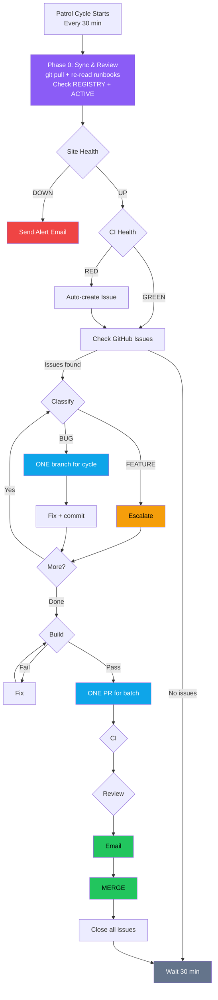

# {{PROJECT_NAME}} Operations Hub

> Every agent session starts here. Read this file before touching code.

This is the operational source of truth for {{PROJECT_NAME}} development. It
lives at `ops/` in the private `{{REPO_NAME}}` repo.

## How to Use This

1. New session? Read this file, then check `slices/REGISTRY.md` and `projects/ACTIVE.md`
2. Starting work? Claim your slice in `REGISTRY.md` before creating branches
3. Finishing work? Update `REGISTRY.md`, update `projects/ACTIVE.md`, write a log entry
4. Need a process? Check `runbooks/` before improvising
5. Handing work back to {{THREADMASTER_ROLE}}? Follow `runbooks/threadmaster-handoff.md`
6. Research or architecture request? Follow `runbooks/research-planning.md`
7. Unsure about a rule? Check `rules/` because they override your instincts

Threadmaster handoffs are machine-checkable:

```bash
node scripts/check-handoff.mjs path/to/handoff.md
```

## Directory Layout

```text
ops/
├── README.md
├── runbooks/
│   ├── bug-fix.md                # End-to-end bug fix workflow
│   ├── bug-patrol.md              # Automation Mac — auto-fix bugs
│   ├── feature-patrol.md          # Primary Mac — build features
│   ├── pr-workflow.md             # PR + quality gates + email
│   ├── incident-response.md       # Site down? Start here
│   ├── health-monitoring.md       # Deep health checks beyond curl
│   ├── daily-digest.md            # Morning summary report
│   ├── loop-contract.md           # Phase 0 sync — all loops must follow
│   ├── changelog.md               # Version management
│   ├── ops-sync.md                # Keep REGISTRY/ACTIVE/JOURNAL in sync
│   ├── dev-workflow.md            # Day-to-day development flow
│   ├── maintainer-gate.md         # Merge validation checklist
│   ├── research-planning.md       # Planning/research workflow
│   ├── slice-management.md        # Work isolation and tracking
│   └── threadmaster-handoff.md    # Handoff packet structure
├── projects/
│   └── ACTIVE.md
├── rules/
│   ├── agent-coordination.md
│   ├── branching.md
│   ├── linear.md
│   └── never-do.md
├── slices/
│   └── REGISTRY.md
└── log/
    └── JOURNAL.md
```

## Patrol Cycle (Visual)



## Patrol Stations

Two machines run continuous AI agent loops:

| Station | Machine | Session | Runbook | Role |
|---------|---------|---------|---------|------|
| **Bug Patrol** | {{AUTOMATION_MAC_NAME}} | `{{AUTOMATION_MAC_SESSION}}` | `runbooks/bug-patrol.md` | Auto-fix bugs, escalate features |
| **Feature Patrol** | {{PRIMARY_MAC_NAME}} | `{{PRIMARY_MAC_SESSION}}` | `runbooks/feature-patrol.md` | Build approved features, monitor |

Both follow the **loop contract** (`runbooks/loop-contract.md`) and share quality gates (`runbooks/pr-workflow.md`).

Both share the same quality gates: `runbooks/pr-workflow.md`

## Quality Gates

Every PR must pass these gates in order before merge:

```
Create branch → Build → Create PR → CI → Code Review → PR Email → Merge
```

See `runbooks/pr-workflow.md` for details.

## Issue Tracker

{{ISSUE_TRACKER_NOTE}}

## The Three Rules

1. Check before you act.
2. Claim before you touch.
3. Log when you're done.
